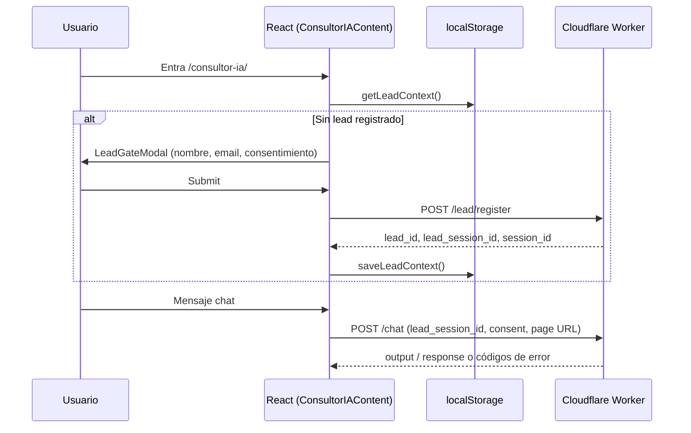

# Contexto del proyecto — Zalantos (sitio corporativo)

> **Nota (estandarización Zalantos, jul 2026):** el contenido vigente de este archivo fue reorganizado en `docs/context/context.md` (breve) y `docs/context/context-extended.md` (técnico extendido), siguiendo el estándar de documentación Zalantos. Este archivo se conserva íntegro como referencia histórica detallada; ante cualquier discrepancia, `docs/context/` es la fuente de verdad más reciente.

Documento de referencia para asistentes de IA y desarrolladores. Resume qué es el repo, cómo está armado y dónde tocar cada cosa.

---

## Identidad del repositorio

| Campo | Valor |
|--------|--------|
| **Carpeta / repo local** | `ventura-analytics` |
| **Nombre npm** | `zalantos-astro` |
| **Producto** | Sitio corporativo estático de **Zalantos** |
| **URL producción** | https://zalantos.com |
| **Empresa** | Zalantos SPA — consultoría en IA, automatización de procesos y análisis de datos para empresas |
| **Email contacto** | contacto@zalantos.com |

**Importante:** El sitio migró de **Next.js 15** a **Astro 4** (output estático). `docs/architecture.md` describe la arquitectura antigua de Next.js y **no refleja el código actual**. Usar este `context.md` y el `README.md` como fuente de verdad.

---

## Objetivo del proyecto

1. **Marketing y SEO:** HTML estático indexable (Google, Bing, bots de IA). Sin SPA vacía.
2. **Conversión:** Home con propuesta de valor, casos de uso, CTA a Sprint 0 (Calendly).
3. **Consultor IA (beta):** Chat en `/consultor-ia/` con registro de lead y backend en Cloudflare Worker.
4. **Blog:** Artículos en Markdown (Content Collections) sobre insights y casos.
5. **Landings de campaña:** Páginas `/lp/...` para LinkedIn u otras campañas.

---

## Stack técnico

- **Framework:** Astro 4 (`output: 'static'`, `build.format: 'directory'`)
- **UI interactiva:** React 18 solo como **islas** (`client:load`) — principalmente el Consultor IA
- **Estilos:** Tailwind CSS 3 + tokens CSS `--z-*` en `src/styles/global.css`
- **Contenido:** Astro Content Collections (`src/content/blog/`)
- **Lenguaje:** TypeScript (strict)
- **HTTP cliente:** `fetch` nativo en `src/lib/api.ts` (axios en `package.json` pero no es el camino principal del chat)
- **Sanitización:** DOMPurify en mensajes del chat
- **Analytics:** Google Analytics 4 `G-X2L1QQ8X0D` en `src/layouts/BaseLayout.astro`

No hay variables de entorno en build local: el sitio es 100 % estático. El deploy es Cloudflare Pages (`NODE_VERSION=20` en el dashboard). Los secrets FTPS `CPANEL_*` son legacy y deben eliminarse — ver `docs/operations/env-vars.md`.

---

## Estructura de directorios (actual)

```
src/
├── content/blog/           # 7 artículos .md + schema en content/config.ts
├── data/landingCampaigns/  # Copy tipado para landings LinkedIn
├── layouts/                # BaseLayout.astro, BlogLayout.astro
├── pages/                  # Rutas Astro → HTML en dist/
├── components/
│   ├── sections/           # Home: Hero, Pillars, Process, etc. (.astro)
│   ├── chat/               # Consultor IA (.tsx, client:load)
│   ├── landing/            # Plantilla landing campañas
│   └── ui/                 # Button, Card, Badge, etc.
├── lib/
│   ├── constants.ts        # Marca, URLs API, storage keys, GA no está aquí
│   ├── api.ts              # registerLead, sendChatMessage, errores UI
│   ├── zalantosSession.ts  # session_id + lead en localStorage
│   └── schemas.ts          # JSON-LD (Organization, WebSite, Service)
├── services/
│   └── chatService.ts      # LEGACY — no importado; usar src/lib/api.ts
├── types/                  # api, session, chat, linkedin landing
└── styles/global.css

public/                     # Copiado tal cual a dist/ (_headers, robots, OG, iconos)
docs/                       # Guías de estilo y architecture.md (obsoleto Next)
.github/workflows/ci.yml    # Verificación de build (no despliega)
```

---

## Rutas y páginas

| Ruta | Archivo | Notas |
|------|---------|--------|
| `/` | `src/pages/index.astro` | Secciones marketing; `?section=contact` muestra Calendly |
| `/blog/` | `src/pages/blog/index.astro` | Listado de posts |
| `/blog/{slug}/` | `src/pages/blog/[slug].astro` | Artículo individual |
| `/consultor-ia/` | `src/pages/consultor-ia.astro` | Isla React completa |
| `/lp/no-todos-problemas-operativos-necesitan-ia/` | `src/pages/lp/...` | Landing LinkedIn |
| `/privacy/` | `src/pages/privacy.astro` | Política de privacidad |
| `/sitemap.xml` | `src/pages/sitemap.xml.ts` | Generado en build (páginas estáticas + posts) |

Enlaces internos centralizados en `src/lib/constants.ts` → `LINKS`.

---

## Principios de arquitectura (Astro)

1. **HTML por defecto:** Casi todo son componentes `.astro` sin JS en cliente.
2. **React solo si hace falta:** Estado, chat, modal de lead, formularios interactivos.
3. **Alias `@/`** → `src/` (configurado en `astro.config.mjs` y `tsconfig.json`).
4. **SEO en cada página:** `title`, `description`, `canonical` pasados a `BaseLayout` + `SEOHead.astro` + `JsonLd.astro`.
5. **Sistema de diseño:** Colores en `COLORS` (`constants.ts`) y variables `--z-*` (`global.css`). Guía extendida: `docs/GUIA_ESTILOS_ZALANTOS.md`.

---

## Flujo: Consultor IA



### Archivos clave

- `src/components/chat/ConsultorIAContent.tsx` — layout página, gate de registro
- `src/components/LeadGateModal.tsx` — registro vía `registerLead()` de `api.ts`
- `src/components/chat/AiChatWidget.tsx` — mensajes, retry, `sendChatMessage()`
- `src/lib/zalantosSession.ts` — `sess_*` session id; keys en `STORAGE_KEYS`
- `src/lib/api.ts` — capa API activa (normaliza respuestas array/n8n, timeouts, `getErrorMapping`)

### Backend (público desde el navegador)

Base: `https://silent-union-0457.tom-s-account-3d0.workers.dev`

- `POST /lead/register` — registro con consentimiento (`CONSENT_VERSION` en constants)
- `POST /chat` — mensajes (timeout 120 s)

### Comportamiento de errores (UI)

`getErrorMapping()` en `api.ts` traduce códigos a acciones:

- `registration_required` → abrir modal de registro
- `out_of_scope` / `blocked_content` → mensaje del asistente (no error rojo)
- `rate_limited` → esperar
- `5xx` / `unauthorized` → banner

### Legacy

`src/services/chatService.ts` duplica lógica antigua del worker **sin** `lead_session_id`. **No usar**; mantener o eliminar en limpieza futura.

---

## Integraciones externas

| Servicio | Uso | Config |
|----------|-----|--------|
| **Cloudflare Worker** | Lead + chat Consultor IA | `WORKER_BASE_URL` en `constants.ts` |
| **Calendly** | Contacto / Sprint 0 | Embebido en `ContactSection.astro` (sin webhook propio) |
| **n8n webhook** | Contacto legacy | `CONTACT_WEBHOOK_URL` — ya no usado por el formulario actual |
| **Google Analytics** | Métricas | Hardcoded en `BaseLayout.astro` |

---

## Blog

- Posts en `src/content/blog/*.md`
- Schema Zod: `title`, `description`, `pubDate`, `category`, `excerpt`, `tags`, etc. (`src/content/config.ts`)
- Slug = nombre del archivo
- Para nuevo artículo: crear `.md` con frontmatter válido; aparece en sitemap automáticamente

---

## Landings de campaña

Patrón:

1. Contenido tipado en `src/data/landingCampaigns/{slug}.ts`
2. Página en `src/pages/lp/{slug}.astro`
3. Componente `LinkedInCampaignLanding.astro`

Ejemplo existente: `no-todos-problemas-operativos-necesitan-ia`.

---

## Build, preview y deploy

```bash
npm install
npm run dev      # http://localhost:4321
npm run build    # genera dist/
npm run preview  # sirve dist/
```

### Deploy producción

1. Push/merge a `main` → **Cloudflare Pages** (integración Git) ejecuta `npm run build` y publica `dist/`
2. En paralelo, `.github/workflows/ci.yml` verifica el build en GitHub Actions (no despliega)
3. Checks esperados en `dist/`: `index.html`, `_headers`, `robots.txt`, `sitemap.xml`, rutas clave
4. Dominio custom + redirect www→apex se configuran en el dashboard de Pages (ver `docs/operations/deployment.md`)

### Cloudflare Pages (headers)

`public/_headers`: Cache-Control para assets vs HTML/XML. Sustituye el antiguo `.htaccess` de Apache/cPanel.

`public/robots.txt`: permite crawlers habituales y bots de IA; apunta al sitemap.

---

## Convenciones para cambios

### Nuevo componente de sección (home)

1. Crear `src/components/sections/Nombre.astro`
2. Importar en `src/pages/index.astro`
3. Usar tokens `--z-*` o clases Tailwind alineadas a la paleta
4. Mantener un solo `<h1>` en la página (está en Hero)

### Nueva página pública

1. `src/pages/ruta/index.astro` o `ruta.astro`
2. `BaseLayout` con `title`, `description`, `canonical` absoluto a `https://zalantos.com/...`
3. Añadir entrada en `staticPages` de `src/pages/sitemap.xml.ts` si es estática

### Consultor IA / API

- Modificar **`src/lib/api.ts`**, no `chatService.ts`
- Actualizar tipos en `src/types/api.types.ts` si cambia el contrato del worker
- Respetar `CONSENT_VERSION` al cambiar textos legales de privacidad

### Estilos

- Fuente de verdad CSS: `src/styles/global.css`
- Constantes TS duplicadas para uso en componentes: `COLORS` en `constants.ts`
- Evitar colores hardcodeados nuevos; reutilizar `#0B2A3C`, `#2FBF71`, `#6F7A83`, `#3FA9F5`

---

## Documentación auxiliar en el repo

| Archivo | Contenido |
|---------|-----------|
| `README.md` | Setup, deploy manual FTP, checklist post-deploy, SEO |
| `context.md` | Este archivo |
| `docs/GUIA_ESTILOS_ZALANTOS.md` | Paleta, tipografía, componentes UI |
| `docs/GUIA_ESTILOS_INFORME_APV.md` | Estilos informes (relacionado marca, no el sitio web) |
| `docs/architecture.md` | **Obsoleto** (Next.js App Router) |

---

## Checklist rápido para una IA que entra al repo

1. ¿Es cambio de contenido marketing? → `.astro` en `sections/` o `pages/`
2. ¿Es el chat o leads? → `components/chat/`, `LeadGateModal.tsx`, `lib/api.ts`, `zalantosSession.ts`
3. ¿Es blog? → `content/blog/` + schema en `content/config.ts`
4. ¿Es SEO/sitemap? → meta en página + `sitemap.xml.ts` + `SEOHead.astro`
5. ¿Es estilo global? → `global.css` + guía Zalantos
6. ¿Requiere JS en cliente? → Solo entonces React con directiva `client:*` en la página Astro padre
7. Tras cambios de rutas: `npm run build` y comprobar que `dist/` incluye la nueva ruta

---

## Qué NO es este proyecto

- No es un dashboard ni app autenticada
- No tiene API routes en Astro (solo endpoint de sitemap en build)
- No usa Supabase, base de datos ni SSR en producción
- No confundir con otros productos Ventura Analytics / n8n internos salvo URLs legacy en constants

---

*Última revisión alineada al código: mayo 2026. Actualizar este archivo si cambian el worker, rutas principales o el flujo de registro del Consultor IA.*
