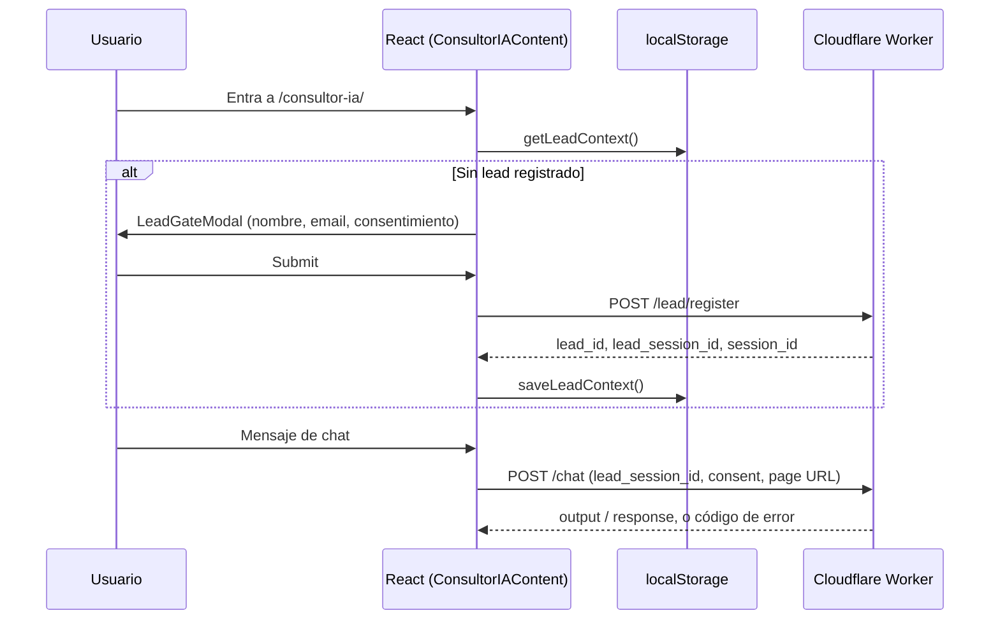

# Contexto técnico extendido

## Módulos principales

| Módulo | Ruta | Responsabilidad |
|---|---|---|
| Páginas | `src/pages/` | Rutas públicas → HTML en `dist/` |
| Secciones de home | `src/components/sections/` | Hero, Pillars, Process, Clients, UseCases, CTAFinal, AboutSection, ContactSection, Sprint0Section (todo `.astro`, sin JS de cliente salvo lo necesario) |
| Consultor IA | `src/components/chat/` | `ConsultorIAContent.tsx` (layout + gate), `AiChatWidget.tsx` (mensajes), `ChatPanel.tsx`, `ChatEmptyState.tsx`, `OnboardingPanel.tsx` — única isla React compleja del sitio |
| Lead gate | `src/components/LeadGateModal.tsx` | Modal de registro (nombre, apellido, email, consentimiento) antes de habilitar el chat |
| Landings de campaña | `src/components/landing/LinkedInCampaignLanding.astro` + `src/data/landingCampaigns/{slug}.ts` + `src/pages/lp/{slug}.astro` | Patrón reutilizable para landings de tráfico pagado/campaña |
| Blog | `src/content/blog/*.md` + `src/content/config.ts` | Content Collections de Astro, 8 artículos en Markdown con frontmatter tipado (Zod) |
| Capa de API | `src/lib/api.ts` | `registerLead()`, `sendChatMessage()`, `postJson()` (fetch + timeout + AbortController), `normalizeApiPayload()`, `getErrorMapping()` |
| Sesión de cliente | `src/lib/zalantosSession.ts` | Gestión de `localStorage`: `getOrCreateSessionId`, `getLeadContext`, `saveLeadContext`, `clearLeadContext` |
| Constantes | `src/lib/constants.ts` | Marca, colores, URLs internas (`LINKS`), URLs del Worker, `CONSENT_VERSION`, `STORAGE_KEYS` |
| SEO | `src/components/SEOHead.astro`, `src/components/JsonLd.astro`, `src/lib/schemas.ts`, `src/pages/sitemap.xml.ts` | Metadata, JSON-LD (Organization, WebSite, Service), sitemap generado en build |
| UI base | `src/components/ui/` | `Button`, `Card`, `Badge`, `Input`, `Section`, `LinkButton`, `AiCtaButton` |
| Legacy | `src/services/chatService.ts` | Lógica antigua del worker **sin** `lead_session_id`; **no está en uso**, no importar ni extender |

## Flujo de datos

### Home / marketing

```
src/pages/index.astro
  → importa secciones de src/components/sections/
  → cada sección usa componentes de src/components/ui/
  → sin llamadas a API (contenido estático); Contact usa el embed de Calendly
```

### Consultor IA (flujo completo)



- Backend externo: `https://silent-union-0457.tom-s-account-3d0.workers.dev` (`WORKER_BASE_URL`).
- Endpoints: `POST /lead/register` (registro), `POST /chat` (mensajes, timeout de 120s vs. 20s de otras llamadas).
- `normalizeApiPayload()` tolera respuestas en formato array o envueltas en `{ body }` / `{ data }` (compatibilidad con formatos típicos de n8n), aunque el backend actual es el Worker de Cloudflare, no n8n.

### Blog

```
src/pages/blog/index.astro   → lista artículos (Content Collections)
src/pages/blog/[slug].astro  → artículo individual, usa BlogLayout.astro
```

### Landings de campaña

```
src/data/landingCampaigns/{slug}.ts   → copy tipado
src/pages/lp/{slug}.astro             → página
src/components/landing/LinkedInCampaignLanding.astro → componente de layout
```

## Jobs / workers

No hay jobs, colas ni cron en este repo. El único "worker" relevante es el **Cloudflare Worker externo** que resuelve leads y chat; su código, infraestructura y modelo de datos no están en este repositorio (`GAP:` documentar en el repo del Worker si existe acceso).

## Autenticación

No hay autenticación de usuarios (sin login, sin roles, sin NextAuth/Clerk/Supabase Auth). El único control de acceso es el **gate de lead**: el chat exige `lead_session_id` + consentimiento válido en `localStorage`/respuesta del Worker antes de permitir mensajes.

## Manejo de errores

Centralizado en `getErrorMapping()` (`src/lib/api.ts`), que traduce códigos del backend a acciones de UI:

| Código / status | Acción UI |
|---|---|
| `registration_required` (403) | Reabrir `LeadGateModal` |
| `out_of_scope` (422) | Renderizar como mensaje del asistente (no como error) |
| `blocked_content` (403) | Renderizar como mensaje del asistente (no como error) |
| `rate_limited` (429) | Pedir esperar ~30s |
| `invalid_request` (400) | Mensaje inline con detalle |
| `consent_required` | Mensaje inline pidiendo aceptar privacidad |
| `unauthorized` (401) | Banner de servicio no disponible |
| `server_misconfig` / 5xx | Banner de servicio no disponible |
| `network_error` | Mensaje inline de conexión |
| `bad_response` | Banner + `console.error` con detalle |

`postJson()` usa `AbortController` para timeouts (20s por defecto, 120s para chat) y distingue `AbortError` (timeout) de `TypeError` (red).

## Observabilidad

No hay integración de logging/monitoreo (Sentry, Datadog, etc.). Los únicos logs son `console.log`/`console.error` en `src/lib/api.ts`, visibles solo en la consola del navegador del usuario. `GA4` (`G-X2L1QQ8X0D`, hardcodeado en `src/layouts/BaseLayout.astro`) es la única fuente de analítica de uso.

## Riesgos técnicos

- **Dependencia crítica en un servicio externo no versionado en este repo:** si cambia el contrato del Worker, hay que actualizar `src/lib/api.ts` y `src/types/api.types.ts` manualmente sin tests que lo detecten.
- **Sin tests:** cualquier regresión en el flujo de leads/chat solo se detecta manualmente.
- **Credenciales de FTP en GitHub Secrets:** único mecanismo de despliegue; si se filtran, se compromete la publicación del sitio.
- **`docs/architecture.md` obsoleto** puede confundir a un agente o desarrollador nuevo si no lee `docs/context/context.md` primero.

## Deuda técnica conocida

- `src/services/chatService.ts` (legacy, sin `lead_session_id`) sigue en el repo sin usarse — candidato a eliminar tras confirmar que nada lo importa.
- `axios` en dependencias sin uso detectado en `src/` — candidato a remover del `package.json` (requiere confirmación explícita, ver regla de "no cambiar dependencias sin pedido" en `AGENTS.md`).
- `CONTACT_WEBHOOK_URL` (n8n) definido en `constants.ts` pero no usado por la UI actual (Calendly lo reemplazó) — mantenido por si se reactiva.
